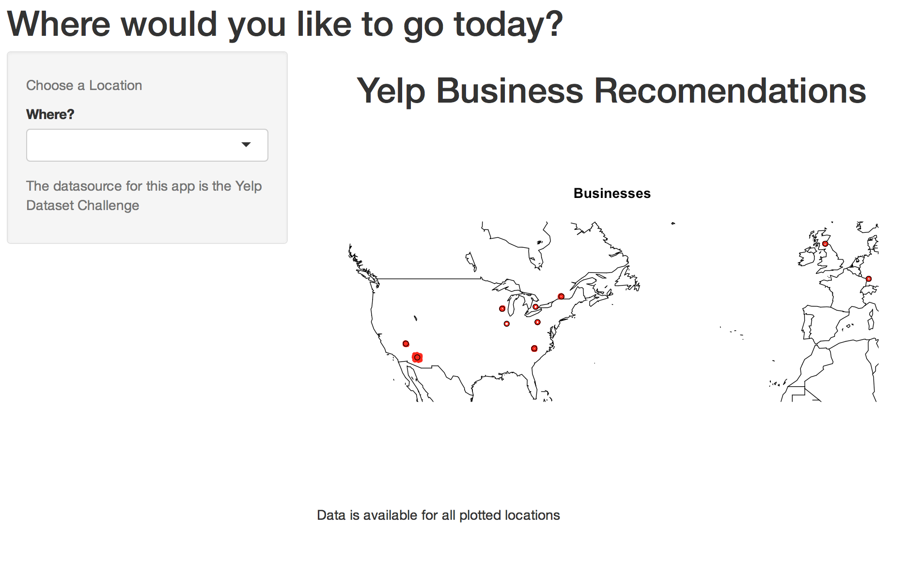
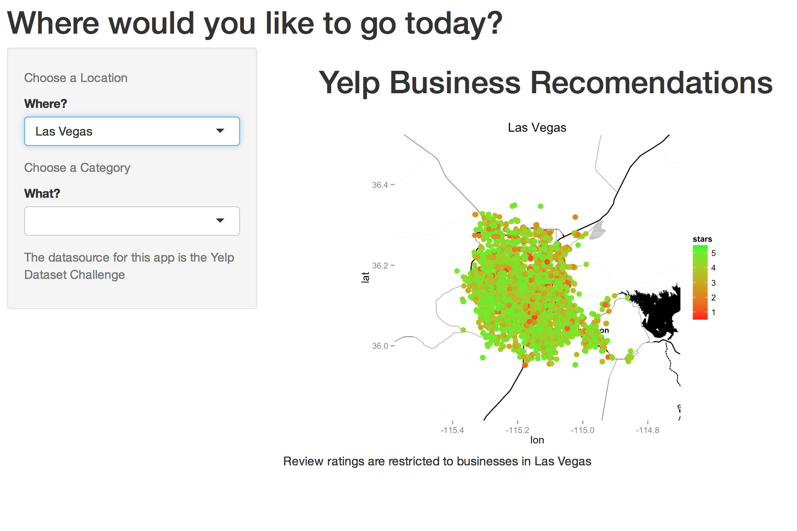
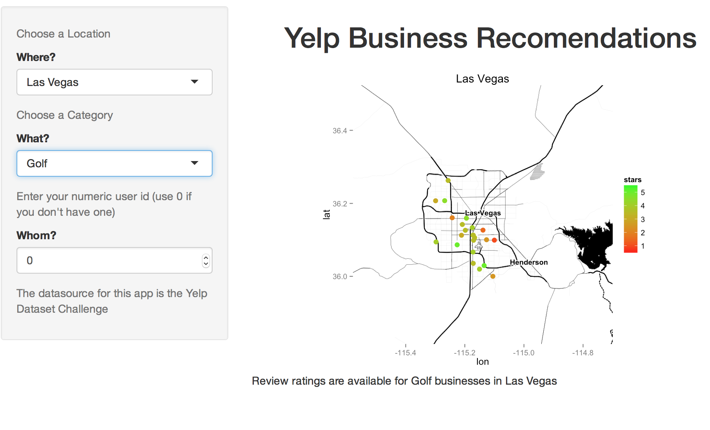

# Title:
Business Recommendations for Yelp Reviewers

# Introduction:

The Yelp dataset contains over 1.5 million reviews for businesses in 10 different locations. The anout of data is impressive, but with 360 thousand reviewers and 80 thousand businesses the sparseness of the data is intimidating.

I wanted to create a recommender system that would analyze a users reviews and compare those to other users to find similar features between them. Then I could use the different users to fill in the gaps in each other and make recomendations on where to go next.

Recommender systems are in use in a lot of different ways, from recommending films to brands of footwear. The same should be possible for businesses.

Some of the most interesting recomendation ideas have come out of the NetFlix competitions. One of the shining examples is Matrix Factorization.

There are lots of ways to do matrix factorization, but we have a special case here. The data is very, very sparse, less than 1/10,000 ratings are filled in. The matrix is too big to handle in reasonable compute time.

# Methods and Data:

Initially I decided that there was just too much data to achieve any results in a timely manner, so I decided to limit the scope. I trimmed down the data to just the ratings by users for businesses. This data represents over 1.5 million ratings out of a possible 22 billion if evryone rated every business. Using each rating to effectively recommend over 10,000 other ratings seemed unlikely.

Matrix factorization has proven to be a useful technique for reducing this kind of problem, so I explored a variety of factorization techniques, and how to implement them in R. I started by selecting a small data set from the data, limiting the scope to just a thousand users and a hundred businesses to get a handle on what I could accomplish with the compute power I had (a MacBook running RStudio).

The main lesson I leared was that standard factorization is not that useful. I needed to be careful about how to evaluate the factored matrices. Taking the factors and recombining them into a big matrix was time consuming, in order to identify the discrepancies between the true ratings and predicted ratings. I did try multiple methods to get fast factorization, regular svd (single value decomposition), nmf (non-negative matrix factorization), irlba (augmented implicitly restarted Lanczos bi-diagonalization), but it just wasnt working. At first I didn’t realize that the standard factorization packages I was trying to use were not working at all. Although I was able to validate the factorization, the predictions were horrible. The problem was that they were predicting the unknowns to match either zero or the mean or whatever I used to fill in the rest of the matrix initially.

The big break came when I found a blog post by Saurabh Bhatnagar (http://sanealytics.com/2015/03/10/ matrix-factorization/) which made perfect sense. I’ve implemented a version of his algorithm to fir the known ratings without skewing the results towards the unknown ratings. The algorithm is basically doing Single Value Decomposition (Matrix Facotrization) but with a specialized cost function that ignores the unknown locations in the matrix.

This works very well on small enough matrices and samples, but when I tried to include more data, the time required to do the computations became infeasible. Even reducing the dataset to just a single city, the computations could not be completed.

So I’ve divided up the data. Many of the recomendations are not related to each other anyway. A recomendation for a Dentist is unlikely to inform a recomendation for a Thai Restaurant. A recomendation In Phoenix is unlikely to inform one in Edinburg.

I’ve divided up the data by location and catagory. It’s manageable now. That said, because there are 783 categories and 10 locations, the number of independant recomendation matrices is on the order of 6700. The features that fall out ofeach factorization are latent (unknownable), but are useful features in any case. The factorization can not then be reintegrated to create a complete matrix with ratings for every business for every user. Our solution is limited to providing recomendations only to users who have rated businesses within a category and location. When the user has not rated anything, we can’t recommend specifically for them, and then simply present the businesses average ratings.

# Results:

We can actually make recomendations using this technique. Any user that has rated a business in a particular location and category will get recommendations for all other businesses in that location for that category. Ene though there are almost 800 different categories, a user does not need to make 800 reviews to get useful recommendations. Many businesses belong to multiple categories (a Bar and a Restaurant and an Italian one) so that recomendations can be useful even in unexpected categories.

# Discussion

We now have a Shiny app that can be used to present the recomendations.

The App starts with a view of the world and identifies the locations where reviews exiist. The first dropdown list to the left allows for selecting a location (one of the 10 that exist in the data):

In this case, Las Vega has been selected.

Once the Location is selected, and the overwhelming number of businesses show up, the next step is to select a category for the recomendation desired.

Once the category "Gol" has been slelected, the number of businesses on the map decreases dramatiaclly.

At this point we'd like to get the user to select their user number from the box on the left. This then loads recomendations (if they exist) and will changed the colors/ratings for the businesses on the map according to the predictions for the user.

This last bit is not yet implemented. The data is loaded, but the results are not displayed.

Other future planned enhancements were not made. I intended to zoom in closer to the businesses, and also add more information in an additional screen, listing the businesses and their data. However, this became more than I could accomplish.

I think the project has progressed well, but there is a great deal more I would still like to do.

Here are links to everything making up this project:

The Source Code: https://github.com/tbartold/YelpHelp

The R Presentation: http://rpubs.com/bartold/YelpHelp

The Shiny App: https://bartold.shinyapps.io/YelpHelp
